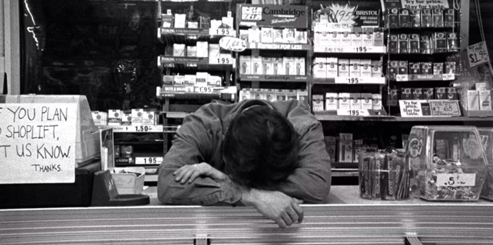

# Dante


[](https://github.com/mdcpepper/dante/actions/workflows/ci.yml)

Dante is a high-performance, general-purpose pricing, promotion and basket 
optimisation engine written in Rust.

## Promotions

Promotions are rules that select candidate items via tag intersections, and 
apply a discount to them. Promotion applications are treated as a global basket 
optimisation problem and the combination that produces the lowest total basket 
price is chosen.

Each item is either left at full price or claimed by exactly one promotion. 
Promotion types can add their own constraints (e.g. bundled deals) and produce 
per-item applications (including original/final prices and bundle groupings) 
that can be rendered on a receipt. Each promotion type is documented in its own
section below.

### Direct Discount Promotion

A simple, direct percentage discount or fixed price override applied to qualifying 
items independently (no bundling).

```bash
cargo run --release --example basket -- -f direct
```

```
───────────────────────────────────────────────────────────────────────────────────────────
        Item       Tags     Base Price   Discounted Price   Savings           Promotion    
═══════════════════════════════════════════════════════════════════════════════════════════
 #1     Sandwich            £2.99                                                          
───────────────────────────────────────────────────────────────────────────────────────────
 #2     Drink      20-off   £1.29        £1.03              -£0.26 (20.16%)   #1   20% Off 
───────────────────────────────────────────────────────────────────────────────────────────
 #3     Snack      20-off   £0.79        £0.47              -£0.32 (40.51%)   #2   40% Off 
                   40-off                                                                  
───────────────────────────────────────────────────────────────────────────────────────────

Subtotal: £5.07
Total:    £4.49
Savings:  £0.58 (11.44%)
```

In this example "Drink" qualifies for the "20% off" promotion, and "Snack" 
qualifies for _both_ the "20% off" and the "40% off" promotion. Applying the 40% 
promotion to the "Snack" item results in the cheapest total basket price, so 
it is that one that is applied to that item.

## Positional Discount Promotion

These promotions apply discounts to specific positions when items are ordered 
by price. This category encompasses BOGOF (2-for-1), BOGOHP (second item half price), 
3-for-2, 5-for-3, and similar X-for-Y offers.

```bash
cargo run --release --example basket -- -f positional
```

```
──────────────────────────────────────────────────────────────────────────────────────────────────────────────────────
        Item                          Tags      Base Price   Discounted Price   Savings         Promotion             
══════════════════════════════════════════════════════════════════════════════════════════════════════════════════════
 #1     Multivitamins 30 gummies      3-for-2   £4.50                                           #1   3-for-2 Vitamins 
──────────────────────────────────────────────────────────────────────────────────────────────────────────────────────
 #2     Vitamin C 1000mg 20 Tablets   3-for-2   £1.99        £0.00              -£1.99 (100%)   #1   3-for-2 Vitamins 
──────────────────────────────────────────────────────────────────────────────────────────────────────────────────────
 #3     Magnesium 180 Tablets         3-for-2   £12.85                                          #1   3-for-2 Vitamins 
──────────────────────────────────────────────────────────────────────────────────────────────────────────────────────

Subtotal: £19.34
Total:    £17.35
Savings:  £1.99 (10.29%)
```

## Global Optimisation

Baskets are globally optimised for the lowest price given the items added, and 
the configured promotions. As items are added to the basket, promotions may 
"steal" products from existing applications, if doing so results in a lower 
basket price, removing the previous application, as items may only participate 
in a single promotion (at least until stacking is implemented).

For example, with two configured promotions:

- 15% Off Toiletries (items tagged: `toiletries`)
- 3-for-2 Haircare Mix & Match (items tagged: `haircare`)

The following scenario plays out as items tagged with both `toiletries` and 
`haircare` are added to the basket one by one:

```bash
cargo run --release --example basket -- -f complex -n 1
```

Increase `-n` to add each item to the basket.

### 1 Item

```
───────────────────────────────────────────────────────────────────────────────────────────────────────────────
        Item            Tags         Base Price   Discounted Price   Savings           Promotion               
═══════════════════════════════════════════════════════════════════════════════════════════════════════════════
 #1     Shampoo 400ml   haircare     £4.50        £3.82              -£0.68 (15.11%)   #1   15% Off Toiletries 
                        toiletries                                                                             
───────────────────────────────────────────────────────────────────────────────────────────────────────────────

Subtotal: £4.50
Total:    £3.82
Savings:  £0.68 (15.11%)
```
1 single item has the 15% discount applied.

### 2 Items

```
───────────────────────────────────────────────────────────────────────────────────────────────────────────────────
        Item                Tags         Base Price   Discounted Price   Savings           Promotion               
═══════════════════════════════════════════════════════════════════════════════════════════════════════════════════
 #1     Shampoo 400ml       haircare     £4.50        £3.82              -£0.68 (15.11%)   #1   15% Off Toiletries 
                            toiletries                                                                             
───────────────────────────────────────────────────────────────────────────────────────────────────────────────────
 #2     Conditioner 400ml   haircare     £4.00        £3.40              -£0.60 (15.00%)   #2   15% Off Toiletries 
                            toiletries                                                                             
───────────────────────────────────────────────────────────────────────────────────────────────────────────────────

Subtotal: £8.50
Total:    £7.22
Savings:  £1.28 (15.06%)
```

There are still not enough items tagged `haircare` to trigger the 
"3-for-2 Haircare Mix & Match" promotion to apply.

### 3 Items

```
─────────────────────────────────────────────────────────────────────────────────────────────────────────────────────────
        Item                      Tags         Base Price   Discounted Price   Savings           Promotion               
═════════════════════════════════════════════════════════════════════════════════════════════════════════════════════════
 #1     Shampoo 400ml             haircare     £4.50        £3.82              -£0.68 (15.11%)   #1   15% Off Toiletries 
                                  toiletries                                                                             
─────────────────────────────────────────────────────────────────────────────────────────────────────────────────────────
 #2     Conditioner 400ml         haircare     £4.00        £3.40              -£0.60 (15.00%)   #2   15% Off Toiletries 
                                  toiletries                                                                             
─────────────────────────────────────────────────────────────────────────────────────────────────────────────────────────
 #3     Travel Shower Gel 100ml   haircare     £1.00        £0.85              -£0.15 (15.00%)   #3   15% Off Toiletries 
                                  toiletries                                                                             
─────────────────────────────────────────────────────────────────────────────────────────────────────────────────────────

Subtotal: £9.50
Total:    £8.07
Savings:  £1.43 (15.05%)
```

Now we have 3 `haircare` items, so the 3-for-2 is technically possible, but 
it's a bad deal right now because the "free" item would be the £1.00 shower gel.

Keeping 15% off on all three results in a basket total of £8.07, but applying 
the 3-for-2 promotion results in a basket total of £8.50, so it's better for the 
customer to retain the original 15% discount.

### 4 Items

```
───────────────────────────────────────────────────────────────────────────────────────────────────────────────────────────────────
        Item                      Tags         Base Price   Discounted Price   Savings           Promotion                         
═══════════════════════════════════════════════════════════════════════════════════════════════════════════════════════════════════
 #1     Shampoo 400ml             haircare     £4.50                                             #2   3-for-2 Haircare Mix & Match 
                                  toiletries                                                                                       
───────────────────────────────────────────────────────────────────────────────────────────────────────────────────────────────────
 #2     Conditioner 400ml         haircare     £4.00                                             #2   3-for-2 Haircare Mix & Match 
                                  toiletries                                                                                       
───────────────────────────────────────────────────────────────────────────────────────────────────────────────────────────────────
 #3     Travel Shower Gel 100ml   haircare     £1.00        £0.85              -£0.15 (15.00%)   #1   15% Off Toiletries           
                                  toiletries                                                                                       
───────────────────────────────────────────────────────────────────────────────────────────────────────────────────────────────────
 #4     Body Wash 500ml           haircare     £3.00        £0.00              -£3.00 (100%)     #2   3-for-2 Haircare Mix & Match 
                                  toiletries                                                                                       
───────────────────────────────────────────────────────────────────────────────────────────────────────────────────────────────────

Subtotal: £12.50
Total:    £9.35
Savings:  £3.15 (25.20%)
```

When the "Body Wash" item is added, the basket reaches a point where the 
previously optimal choice (applying 15% off to every item) is no longer 
globally the cheapest. 

Keeping the flat 15% discount on all items results in a total of £10.62, 
but forming a 3-for-2 haircare bundle allows the engine to group the three most 
expensive eligible items (Shampoo @ £4.50, Conditioner @ £4.00, Body Wash £3.00) 
and make the £3.00 item free, which is worth more than the cumulative 15% saving 
on those three items. The remaining Travel Gel stays on the 15% discount at £0.85, 
giving a new total of £9.35.

### 5 Items

```
───────────────────────────────────────────────────────────────────────────────────────────────────────────────────────────────────────
        Item                          Tags         Base Price   Discounted Price   Savings           Promotion                         
═══════════════════════════════════════════════════════════════════════════════════════════════════════════════════════════════════════
 #1     Shampoo 400ml                 haircare     £4.50                                             #3   3-for-2 Haircare Mix & Match 
                                      toiletries                                                                                       
───────────────────────────────────────────────────────────────────────────────────────────────────────────────────────────────────────
 #2     Conditioner 400ml             haircare     £4.00        £0.00              -£4.00 (100%)     #3   3-for-2 Haircare Mix & Match 
                                      toiletries                                                                                       
───────────────────────────────────────────────────────────────────────────────────────────────────────────────────────────────────────
 #3     Travel Shower Gel 100ml       haircare     £1.00        £0.85              -£0.15 (15.00%)   #1   15% Off Toiletries           
                                      toiletries                                                                                       
───────────────────────────────────────────────────────────────────────────────────────────────────────────────────────────────────────
 #4     Body Wash 500ml               haircare     £3.00        £2.55              -£0.45 (15.00%)   #2   15% Off Toiletries           
                                      toiletries                                                                                       
───────────────────────────────────────────────────────────────────────────────────────────────────────────────────────────────────────
 #5     Deep Repair Hair Mask 250ml   haircare     £6.00                                             #3   3-for-2 Haircare Mix & Match 
                                      toiletries                                                                                       
───────────────────────────────────────────────────────────────────────────────────────────────────────────────────────────────────────

Subtotal: £18.50
Total:    £13.90
Savings:  £4.60 (24.86%)
```

When the "Deep Repair Hair Mask" item is added, the solver re-optimises _again_ 
because the set of eligible `haircare` items has changed, and there is now a 
higher priced item available. 

Becaues the value of the 3-for-2 promotion depends on which item becomes free, 
the optimal bundle includes the most expensive items, so that the "free" slot 
is maximised. The bundle therefore re-shuffles, to include the Hair Mask (£6.00), 
Shampoo (£4.50), and Conditioner (£4.00), making the £4.00 item free, instead 
of the cheaper Body Wash. 

Body Wash is pushed back out of the bundle, and returns to having just the 15% 
`toiletries` discount.
